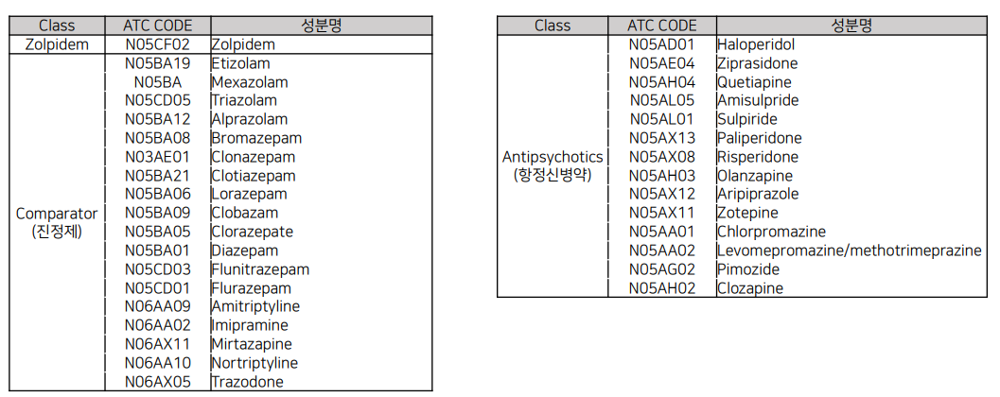
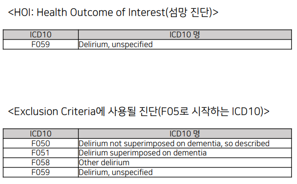
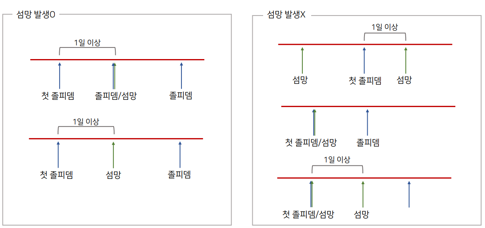
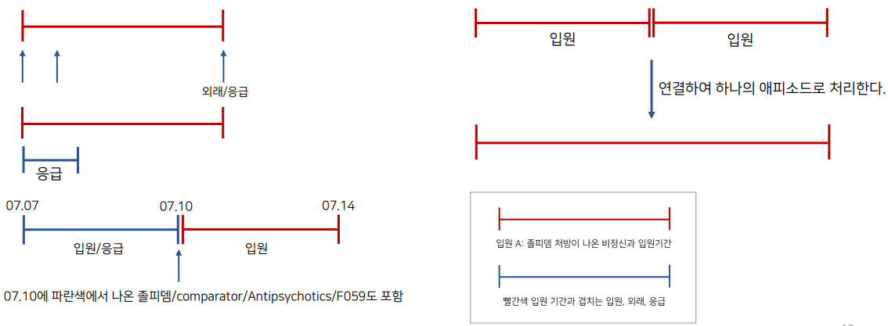
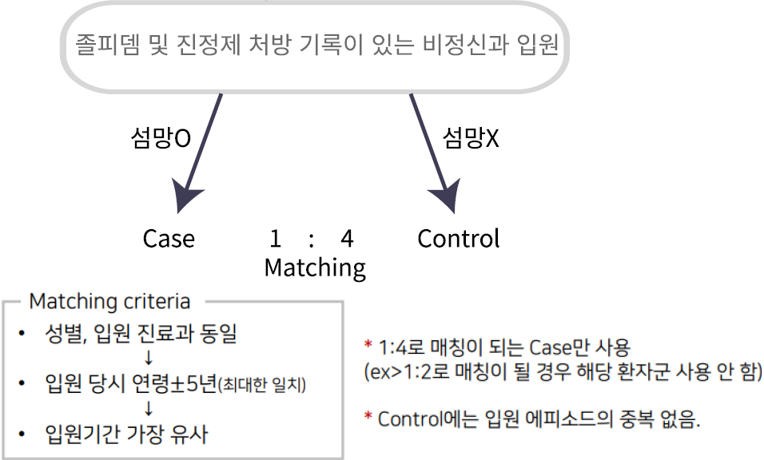

# **Zolpidem 연구**

## 연구 목적

- 졸피뎀의 정신신경계 부작용(섬망*) 현황 조사

- 섬망 발생의 Risk factor 확인
  
  섬망: 신체 질환이나, 약물, 술 등으로 인해 뇌의 전반적인 기능장애가 발생하는 증후군.  주의력 저하와 의식 수준, 인지 기능 저하를 특징으로 함.  
  그 외 환시와 같은 지각의 장애, 비정상적인 정신운동 활성, 수면 주기의 문제가 동반되기도 함.

## 사용 데이터

### 약물

- Comparator(진정제): 진정 효과가 있는 약들도 섬망 발생의 위험이 있어 졸피뎀과 더불어 섬망 발생 위험을 보고자하여 본 연구에 포함.

- 대상 ATC CODE의 모든 약물 용량, 약물 유형(tablet, disintegrating oral tablet, injection) 사용함.

### 진단

## 연구 설계

### Nested Case-Control Study

- 비정신과 입원 상황에서 급성으로 발병하는 섬망이 HOI

- 이러한 상황에서 섬망 발생 직전(3일 전, 7일 전)에 이 환자는 어떠한 리스크 요인를 가지고 있었는가?
  (졸피뎀 복용을 하였는가? Comparator 약물만 복용하였는가? 졸피뎀을 복용하였다면, 졸피뎀을 얼마나 복용하였는가? 어떤 약물들과 같이 복용을 하였는가?)

### 졸피뎀으로 인한 섬망 발생 에피소드 정의(환자군)

- 전체 pool : 졸피뎀 OR comparator 처방이 있는 비정신과 입원

- 섬망 발생 정의 : F059진단 OR/AND Antipsychotics 처방

#### Exclusion Criteria

입원 당시 및 이전 6개월 동안의 Delirium 상병(F05로 시작하는 ICD10코드) OR antipsychotics 처방이 있었던 환자 제외

#### 세부 조건

- 비정신과 입원 중 섬망 발생 후 첫 졸피뎀 OR comparator 처방이 있을 경우 제외함.

- Blackout period 1일 적용(ie. 졸피뎀/comparator 첫 처방 다음 날 이후 F059, Antipsychotics가 있을 경우 섬망 발생으로 인정됨

- 입원 기간 중 진단/처방이 시작되는 내역도 모두 사용(외래,응급,입원 기록 모두 가져옴.

- 졸피뎀 처방 비정신과 입원들이 시간상 연결 된다면, 그 입원들을 모두 연결시켜 하나의 입원 에피소드로 간주.

### Case-Control Matching

